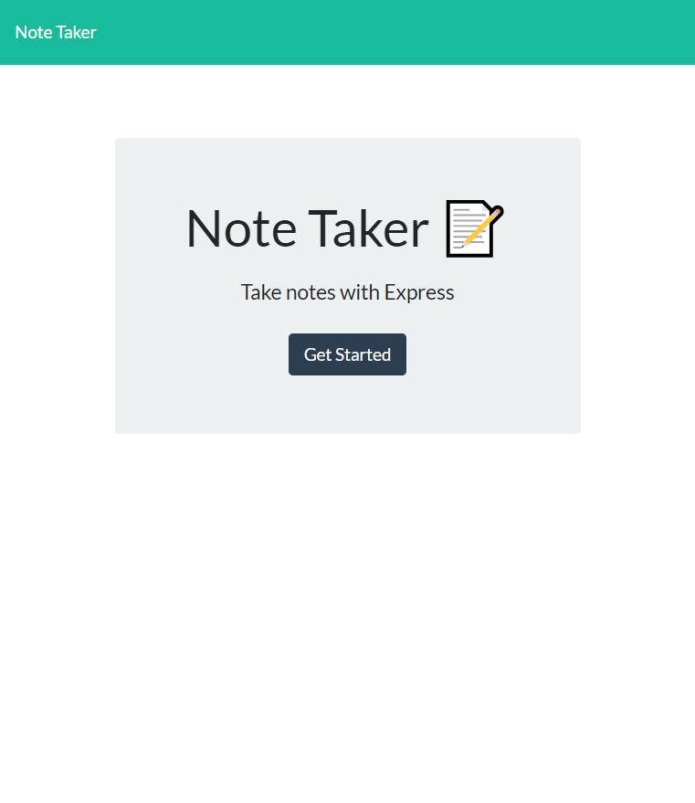

# note-taker

## Description
Note Taker that can be used to write and save notes. This application will use an Express.js back end and will save and retrieve note data from a JSON file.
Once you open the app you are presented with a home page that you use to get to the notes page. On the notes page you can see all your previously saved notes on the left and the option 
to make a new note. Once you fill in the note critria you click the save icon in the top right and the note will save in the left column along with your other saved notes. You can click on the 
saved notes to view the note. Once you are done with a certain note you can delete the note by clicking the trash icon to the right of the saved note.
## Link 

<a href="https://09-note-taker-production.up.railway.app/">link to website </a>

## Screenshot 

